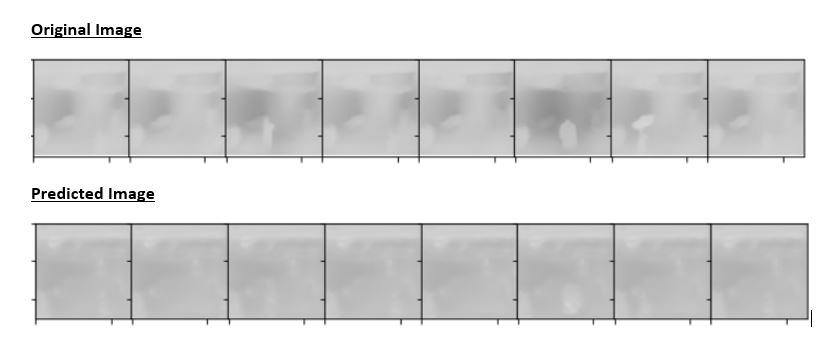
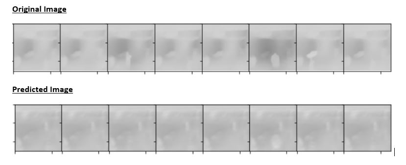
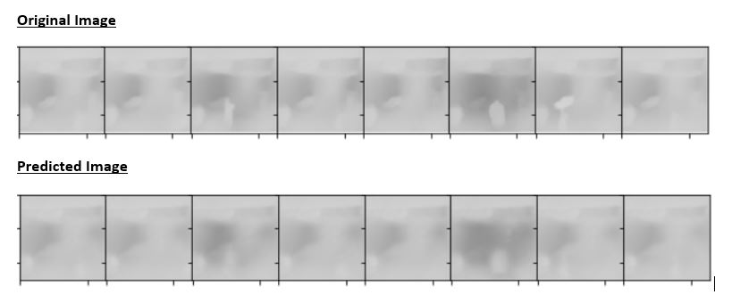
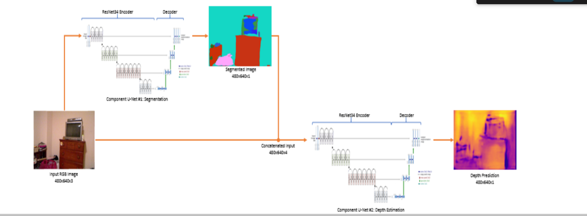

# Final Assignment - Train a Model to Predict Mask and Depth of Given Image

## Problem Statement

This assignment builds over Assignment 14(which was to generate a 400k overlapped dataset along with their depth predictions). The task was to design a model which predicts a depth map and a segmentation mask of the same.


## Setup For The Process

**Apun Bhagwaan nahi hai!** And sadly, the writer didn't know the perfect model and plethora of other things right at the beginning. Hence came the necessity of setting up a process to quickly test what works and what not. In addition to the final dataset, two other datasets of 24 images and 1000 images were created. The dataset of 24 images was considered as ***[Playground](Playground.ipynb)*** and was used to discard the absolute trash. As such, there was no modularization in the playground notebook to ensure faster changes. 

The set of 1000 images was like the Sa Re Ga Ma Pa contest for the promising changes. The ones which performed well here got a break to the final dataset. 


## Model Selection

[U-Net](https://lmb.informatik.uni-freiburg.de/people/ronneber/u-net/) has been quite popular for image segmentation in the Biomedical field where precision is important. This became the natural choice for the model architecture. Two models were chosen which implemented the U-Net architecture, one with about 500k parameters and another one with about 29 million parameters. The smaller model was chosen with a hope that it would run faster and still give decent predictions.

#### Lean Model

```
----------------------------------------------------------------
        Layer (type)               Output Shape         Param #
================================================================
            Conv2d-1           [-1, 16, 64, 64]             448
       BatchNorm2d-2           [-1, 16, 64, 64]              32
              ReLU-3           [-1, 16, 64, 64]               0
        conv_block-4           [-1, 16, 64, 64]               0
            Conv2d-5           [-1, 32, 32, 32]           4,640
       BatchNorm2d-6           [-1, 32, 32, 32]              64
              ReLU-7           [-1, 32, 32, 32]               0
        conv_block-8           [-1, 32, 32, 32]               0
            Conv2d-9           [-1, 64, 16, 16]          18,496
      BatchNorm2d-10           [-1, 64, 16, 16]             128
             ReLU-11           [-1, 64, 16, 16]               0
       conv_block-12           [-1, 64, 16, 16]               0
           Conv2d-13          [-1, 128, 16, 16]          73,856
      BatchNorm2d-14          [-1, 128, 16, 16]             256
             ReLU-15          [-1, 128, 16, 16]               0
       conv_block-16          [-1, 128, 16, 16]               0
           Conv2d-17            [-1, 128, 8, 8]          16,512
      BatchNorm2d-18            [-1, 128, 8, 8]             256
             ReLU-19            [-1, 128, 8, 8]               0
       conv_block-20            [-1, 128, 8, 8]               0
           Conv2d-21          [-1, 128, 16, 16]         295,040
      BatchNorm2d-22          [-1, 128, 16, 16]             256
             ReLU-23          [-1, 128, 16, 16]               0
       conv_block-24          [-1, 128, 16, 16]               0
           Conv2d-25           [-1, 32, 16, 16]          36,896
      BatchNorm2d-26           [-1, 32, 16, 16]              64
             ReLU-27           [-1, 32, 16, 16]               0
       conv_block-28           [-1, 32, 16, 16]               0
           Conv2d-29           [-1, 64, 32, 32]          36,928
      BatchNorm2d-30           [-1, 64, 32, 32]             128
             ReLU-31           [-1, 64, 32, 32]               0
       conv_block-32           [-1, 64, 32, 32]               0
           Conv2d-33           [-1, 32, 32, 32]          18,464
      BatchNorm2d-34           [-1, 32, 32, 32]              64
             ReLU-35           [-1, 32, 32, 32]               0
       conv_block-36           [-1, 32, 32, 32]               0
           Conv2d-37           [-1, 16, 64, 64]           4,624
      BatchNorm2d-38           [-1, 16, 64, 64]              32
             ReLU-39           [-1, 16, 64, 64]               0
       conv_block-40           [-1, 16, 64, 64]               0
           Conv2d-41            [-1, 1, 64, 64]              17
      BatchNorm2d-42            [-1, 1, 64, 64]               2
             ReLU-43            [-1, 1, 64, 64]               0
       conv_block-44            [-1, 1, 64, 64]               0
================================================================
Total params: 507,203
Trainable params: 507,203
Non-trainable params: 0
----------------------------------------------------------------
Input size (MB): 0.05
Forward/backward pass size (MB): 11.12
Params size (MB): 1.93
Estimated Total Size (MB): 13.11
----------------------------------------------------------------
```


#### ResNet Backbone

```
----------------------------------------------------------------
        Layer (type)               Output Shape         Param #
================================================================
            Conv2d-1           [-1, 64, 64, 64]           1,792
              ReLU-2           [-1, 64, 64, 64]               0
            Conv2d-3           [-1, 64, 64, 64]          36,928
              ReLU-4           [-1, 64, 64, 64]               0
            Conv2d-5           [-1, 64, 32, 32]           9,408
            Conv2d-6           [-1, 64, 32, 32]           9,408
       BatchNorm2d-7           [-1, 64, 32, 32]             128
       BatchNorm2d-8           [-1, 64, 32, 32]             128
              ReLU-9           [-1, 64, 32, 32]               0
             ReLU-10           [-1, 64, 32, 32]               0
        MaxPool2d-11           [-1, 64, 16, 16]               0
        MaxPool2d-12           [-1, 64, 16, 16]               0
           Conv2d-13           [-1, 64, 16, 16]          36,864
           Conv2d-14           [-1, 64, 16, 16]          36,864
      BatchNorm2d-15           [-1, 64, 16, 16]             128
      BatchNorm2d-16           [-1, 64, 16, 16]             128
             ReLU-17           [-1, 64, 16, 16]               0
             ReLU-18           [-1, 64, 16, 16]               0
           Conv2d-19           [-1, 64, 16, 16]          36,864
           Conv2d-20           [-1, 64, 16, 16]          36,864
      BatchNorm2d-21           [-1, 64, 16, 16]             128
      BatchNorm2d-22           [-1, 64, 16, 16]             128
             ReLU-23           [-1, 64, 16, 16]               0
             ReLU-24           [-1, 64, 16, 16]               0
       BasicBlock-25           [-1, 64, 16, 16]               0
       BasicBlock-26           [-1, 64, 16, 16]               0
           Conv2d-27           [-1, 64, 16, 16]          36,864
           Conv2d-28           [-1, 64, 16, 16]          36,864
      BatchNorm2d-29           [-1, 64, 16, 16]             128
      BatchNorm2d-30           [-1, 64, 16, 16]             128
             ReLU-31           [-1, 64, 16, 16]               0
             ReLU-32           [-1, 64, 16, 16]               0
           Conv2d-33           [-1, 64, 16, 16]          36,864
           Conv2d-34           [-1, 64, 16, 16]          36,864
      BatchNorm2d-35           [-1, 64, 16, 16]             128
      BatchNorm2d-36           [-1, 64, 16, 16]             128
             ReLU-37           [-1, 64, 16, 16]               0
             ReLU-38           [-1, 64, 16, 16]               0
       BasicBlock-39           [-1, 64, 16, 16]               0
       BasicBlock-40           [-1, 64, 16, 16]               0
           Conv2d-41            [-1, 128, 8, 8]          73,728
           Conv2d-42            [-1, 128, 8, 8]          73,728
      BatchNorm2d-43            [-1, 128, 8, 8]             256
      BatchNorm2d-44            [-1, 128, 8, 8]             256
             ReLU-45            [-1, 128, 8, 8]               0
             ReLU-46            [-1, 128, 8, 8]               0
           Conv2d-47            [-1, 128, 8, 8]         147,456
           Conv2d-48            [-1, 128, 8, 8]         147,456
      BatchNorm2d-49            [-1, 128, 8, 8]             256
      BatchNorm2d-50            [-1, 128, 8, 8]             256
           Conv2d-51            [-1, 128, 8, 8]           8,192
           Conv2d-52            [-1, 128, 8, 8]           8,192
      BatchNorm2d-53            [-1, 128, 8, 8]             256
      BatchNorm2d-54            [-1, 128, 8, 8]             256
             ReLU-55            [-1, 128, 8, 8]               0
             ReLU-56            [-1, 128, 8, 8]               0
       BasicBlock-57            [-1, 128, 8, 8]               0
       BasicBlock-58            [-1, 128, 8, 8]               0
           Conv2d-59            [-1, 128, 8, 8]         147,456
           Conv2d-60            [-1, 128, 8, 8]         147,456
      BatchNorm2d-61            [-1, 128, 8, 8]             256
      BatchNorm2d-62            [-1, 128, 8, 8]             256
             ReLU-63            [-1, 128, 8, 8]               0
             ReLU-64            [-1, 128, 8, 8]               0
           Conv2d-65            [-1, 128, 8, 8]         147,456
           Conv2d-66            [-1, 128, 8, 8]         147,456
      BatchNorm2d-67            [-1, 128, 8, 8]             256
      BatchNorm2d-68            [-1, 128, 8, 8]             256
             ReLU-69            [-1, 128, 8, 8]               0
             ReLU-70            [-1, 128, 8, 8]               0
       BasicBlock-71            [-1, 128, 8, 8]               0
       BasicBlock-72            [-1, 128, 8, 8]               0
           Conv2d-73            [-1, 256, 4, 4]         294,912
           Conv2d-74            [-1, 256, 4, 4]         294,912
      BatchNorm2d-75            [-1, 256, 4, 4]             512
      BatchNorm2d-76            [-1, 256, 4, 4]             512
             ReLU-77            [-1, 256, 4, 4]               0
             ReLU-78            [-1, 256, 4, 4]               0
           Conv2d-79            [-1, 256, 4, 4]         589,824
           Conv2d-80            [-1, 256, 4, 4]         589,824
      BatchNorm2d-81            [-1, 256, 4, 4]             512
      BatchNorm2d-82            [-1, 256, 4, 4]             512
           Conv2d-83            [-1, 256, 4, 4]          32,768
           Conv2d-84            [-1, 256, 4, 4]          32,768
      BatchNorm2d-85            [-1, 256, 4, 4]             512
      BatchNorm2d-86            [-1, 256, 4, 4]             512
             ReLU-87            [-1, 256, 4, 4]               0
             ReLU-88            [-1, 256, 4, 4]               0
       BasicBlock-89            [-1, 256, 4, 4]               0
       BasicBlock-90            [-1, 256, 4, 4]               0
           Conv2d-91            [-1, 256, 4, 4]         589,824
           Conv2d-92            [-1, 256, 4, 4]         589,824
      BatchNorm2d-93            [-1, 256, 4, 4]             512
      BatchNorm2d-94            [-1, 256, 4, 4]             512
             ReLU-95            [-1, 256, 4, 4]               0
             ReLU-96            [-1, 256, 4, 4]               0
           Conv2d-97            [-1, 256, 4, 4]         589,824
           Conv2d-98            [-1, 256, 4, 4]         589,824
      BatchNorm2d-99            [-1, 256, 4, 4]             512
     BatchNorm2d-100            [-1, 256, 4, 4]             512
            ReLU-101            [-1, 256, 4, 4]               0
            ReLU-102            [-1, 256, 4, 4]               0
      BasicBlock-103            [-1, 256, 4, 4]               0
      BasicBlock-104            [-1, 256, 4, 4]               0
          Conv2d-105            [-1, 512, 2, 2]       1,179,648
          Conv2d-106            [-1, 512, 2, 2]       1,179,648
     BatchNorm2d-107            [-1, 512, 2, 2]           1,024
     BatchNorm2d-108            [-1, 512, 2, 2]           1,024
            ReLU-109            [-1, 512, 2, 2]               0
            ReLU-110            [-1, 512, 2, 2]               0
          Conv2d-111            [-1, 512, 2, 2]       2,359,296
          Conv2d-112            [-1, 512, 2, 2]       2,359,296
     BatchNorm2d-113            [-1, 512, 2, 2]           1,024
     BatchNorm2d-114            [-1, 512, 2, 2]           1,024
          Conv2d-115            [-1, 512, 2, 2]         131,072
          Conv2d-116            [-1, 512, 2, 2]         131,072
     BatchNorm2d-117            [-1, 512, 2, 2]           1,024
     BatchNorm2d-118            [-1, 512, 2, 2]           1,024
            ReLU-119            [-1, 512, 2, 2]               0
            ReLU-120            [-1, 512, 2, 2]               0
      BasicBlock-121            [-1, 512, 2, 2]               0
      BasicBlock-122            [-1, 512, 2, 2]               0
          Conv2d-123            [-1, 512, 2, 2]       2,359,296
          Conv2d-124            [-1, 512, 2, 2]       2,359,296
     BatchNorm2d-125            [-1, 512, 2, 2]           1,024
     BatchNorm2d-126            [-1, 512, 2, 2]           1,024
            ReLU-127            [-1, 512, 2, 2]               0
            ReLU-128            [-1, 512, 2, 2]               0
          Conv2d-129            [-1, 512, 2, 2]       2,359,296
          Conv2d-130            [-1, 512, 2, 2]       2,359,296
     BatchNorm2d-131            [-1, 512, 2, 2]           1,024
     BatchNorm2d-132            [-1, 512, 2, 2]           1,024
            ReLU-133            [-1, 512, 2, 2]               0
            ReLU-134            [-1, 512, 2, 2]               0
      BasicBlock-135            [-1, 512, 2, 2]               0
      BasicBlock-136            [-1, 512, 2, 2]               0
          Conv2d-137            [-1, 512, 2, 2]         262,656
            ReLU-138            [-1, 512, 2, 2]               0
        Upsample-139            [-1, 512, 4, 4]               0
          Conv2d-140            [-1, 256, 4, 4]          65,792
            ReLU-141            [-1, 256, 4, 4]               0
          Conv2d-142            [-1, 512, 4, 4]       3,539,456
            ReLU-143            [-1, 512, 4, 4]               0
        Upsample-144            [-1, 512, 8, 8]               0
          Conv2d-145            [-1, 128, 8, 8]          16,512
            ReLU-146            [-1, 128, 8, 8]               0
          Conv2d-147            [-1, 256, 8, 8]       1,474,816
            ReLU-148            [-1, 256, 8, 8]               0
        Upsample-149          [-1, 256, 16, 16]               0
          Conv2d-150           [-1, 64, 16, 16]           4,160
            ReLU-151           [-1, 64, 16, 16]               0
          Conv2d-152          [-1, 256, 16, 16]         737,536
            ReLU-153          [-1, 256, 16, 16]               0
        Upsample-154          [-1, 256, 32, 32]               0
          Conv2d-155           [-1, 64, 32, 32]           4,160
            ReLU-156           [-1, 64, 32, 32]               0
          Conv2d-157          [-1, 128, 32, 32]         368,768
            ReLU-158          [-1, 128, 32, 32]               0
        Upsample-159          [-1, 128, 64, 64]               0
          Conv2d-160           [-1, 64, 64, 64]         110,656
            ReLU-161           [-1, 64, 64, 64]               0
          Conv2d-162            [-1, 1, 64, 64]              65
================================================================
Total params: 28,976,321
Trainable params: 28,976,321
Non-trainable params: 0
----------------------------------------------------------------
Input size (MB): 0.05
Forward/backward pass size (MB): 33.94
Params size (MB): 110.54
Estimated Total Size (MB): 144.52
----------------------------------------------------------------
```

#### Conclusion

The ResNet backed heavier model gave much better outputs for both the tasks but with a little longer training time per epoch. Hence, this was chosen for final training and submission. After all, lean things are not always better! It was also observed that depth prediction required models with much more parameters than mask prediction.


## Loss! Eh? Which Loss Function to Use?

For **mask prediction**, two kinds of losses were experimented upon. **[BCEWithLogitsLoss](https://pytorch.org/docs/master/generated/torch.nn.BCEWithLogitsLoss.html)** and **[Dice Loss](https://arxiv.org/abs/1707.03237)** were considered. In both very small and medium datasets dice loss was more accurate than the former. 

For **depth prediction**, a number of loss functions were experimented. Each one was run for 200 epochs with a learning rate of .01 on 24 images. Thus, apart from the loss function everything else was same. Classic laboratory conditions!

#### L2/MSE Loss



#### Smooth L1/Huber Loss



#### L1 Loss



**L1 Loss** seemed to perform better than Huber loss. Hence it was chosen for Depth Prediction. The final prediction is much better than this!

## Learning Rate - How Fast to Learn!

**Is baar apun Bhagwaan bana!** The author fixed the learning rate to .01 for the first 150 epochs and tried a SteLR for another 150 epochs with a decay of 0.1 and step size of 50. The main reason was to save time on validation after every epoch. However, the author still feels it desirable to use ReduceLROnPlateau for training.

## Results

### Mask Prediction

The [validation](Validate Mask.ipynb) outputs of the last epoch are as shown below. The odd rows(1,3,5) represent the ground truth and the corresponding even rows(2,4,6) represent the predictions. 


### Depth Estimation

The [validation](Validate Depth.ipynb) outputs of the last epoch are as shown below. The odd rows(1,3,5) represent the ground truth and the corresponding even rows(2,4,6) represent the predictions. 


#### Caution

**The ground truth predictions taken from Dense Depth were not good to start with.** The author presumes that this is because his image dataset consisted of both indoor and outdoor backgrounds. Hence neither models trained on NYU nor on KITTY were able to do justice to the whole dataset. But as can be seen, the model does a respectable job on the images. However, the images in the [validation](Validate Depth.ipynb) notebook for depth are a little better than the one shown here due to a larger size of images.

## Logging

tqdm was not used for logging epoch outputs as it would have exceeded the IO limit of the notebooks. Instead Tensorboard was used to log Epoch Loss. The output of each epoch was limited to the epoch number and the time taken. During setting up the model, the number of epochs were kept low and the time taken by major steps was noted down. But in the final version, this was done away with.

## Runtime Environments

### **Google Colab**

Colab was used to run the Playground notebook. However it was found to be too slow for bigger datasets, considering the initial deadline of the assignment.

### **AI Platform Notebooks in GCP** 

Got a **Tesla T4 GPU** on free credits to run experiments on a training dataset of 1000 images. For the chosen model it was **twice as fast compared to Google Colab**. Moving over to different environments necessitated the creation of certain setup and data creation scripts. This is one of many versions of my [setup](Setup.ipynb) scripts. [This](Create Data.ipynb) or a similar script was used to create train and validate datasets.

### **GPUs on [vast.ai](https://vast.ai/)** - 

Rented a **Nvidia GTX 1080 Ti** to run the model on the whole dataset. This was **twice as fast as Tesla T4**. However, close to the deadline, the writer came to terms with a silly mistake he had done. With not much time left, the writer rented a **Nvidia RTX 2080 Ti** which is about **1.3 times faster than the former**. 

## Tried But Failed!

- To implement Serial Unet as given in [this](https://www.insticc.org/node/TechnicalProgram/vehits/2020/presentationDetails/97818) paper. It uses an architecture as given below.

  

  No loss function or combination of it which the author tried gave a satisfactory result for both of tasks at the same time.

- To use models with less than half a million parameters and still get good results.

- To use mask images superimposed on fg_bg images for depth predictions. Didn't get enough time to work this out.

## Further Work

- The author would love to try super resolution on the output images. The fact that there are two different images as output and two different models might be required stopped the author from trying it out before the deadline.
- Given more time and computation compatibility the author would like to try out ReduceLROnPlateau and see how much the model improves.
